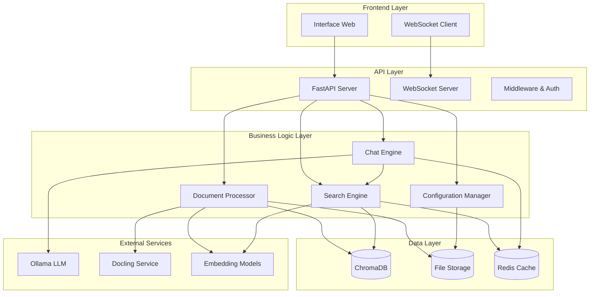

# Design Document - StudyRAG Application

## Overview

StudyRAG est une application web moderne basée sur une architecture modulaire qui intègre plusieurs technologies de pointe pour créer un système RAG (Retrieval-Augmented Generation) complet. L'application utilise FastAPI comme backend, une interface web responsive en frontend, ChromaDB pour le stockage vectoriel, Docling pour l'extraction de documents, des modèles d'embeddings multilingues optimisés, et Ollama pour la génération de réponses.

L'architecture suit le principe de séparation des responsabilités avec des modules distincts pour chaque fonctionnalité principale, permettant une maintenance facile et une évolutivité optimale.

## Architecture

### Architecture Globale



### Architecture Technique

**Stack Technologique :**
- **Backend :** FastAPI + Python 3.11+
- **Frontend :** HTML5 + CSS3 + JavaScript (Vanilla/Alpine.js)
- **Base de données vectorielle :** ChromaDB
- **Cache :** Redis (optionnel)
- **Extraction de documents :** Docling
- **Embeddings :** SentenceTransformers (modèles multilingues)
- **LLM :** Ollama (modèles locaux)
- **WebSockets :** Pour les mises à jour en temps réel

## Components and Interfaces

### 1. Document Processing Service

**Responsabilité :** Extraction, chunking et indexation des documents

```python
class DocumentProcessor:
    def __init__(self, docling_client, embedding_model, chroma_client):
        self.docling = docling_client
        self.embedder = embedding_model
        self.vector_db = chroma_client
    
    async def process_document(self, file_path: str, metadata: dict) -> ProcessingResult:
        """Traite un document complet de l'extraction à l'indexation"""
        pass
    
    async def extract_content(self, file_path: str) -> ExtractedContent:
        """Extrait le contenu avec Docling selon le type de fichier"""
        pass
    
    def chunk_content(self, content: str, metadata: dict) -> List[Chunk]:
        """Découpe le contenu en chunks optimaux"""
        pass
    
    async def generate_embeddings(self, chunks: List[Chunk]) -> List[Embedding]:
        """Génère les embeddings pour les chunks"""
        pass
    
    async def store_in_vector_db(self, chunks: List[Chunk], embeddings: List[Embedding]) -> bool:
        """Stocke dans ChromaDB"""
        pass
```

**Interfaces :**
- `POST /api/documents/upload` - Upload et traitement de documents
- `GET /api/documents/status/{task_id}` - Statut du traitement
- `WebSocket /ws/processing` - Mises à jour en temps réel

### 2. Search Engine Service

**Responsabilité :** Recherche sémantique et récupération de contexte

```python
class SearchEngine:
    def __init__(self, embedding_model, chroma_client, cache_client):
        self.embedder = embedding_model
        self.vector_db = chroma_client
        self.cache = cache_client
    
    async def semantic_search(self, query: str, filters: dict = None, top_k: int = 10) -> SearchResults:
        """Effectue une recherche sémantique"""
        pass
    
    async def hybrid_search(self, query: str, filters: dict = None) -> SearchResults:
        """Combine recherche sémantique et lexicale"""
        pass
    
    def rerank_results(self, results: List[SearchResult], query: str) -> List[SearchResult]:
        """Réordonne les résultats par pertinence"""
        pass
    
    async def get_context_for_rag(self, query: str, max_tokens: int = 4000) -> str:
        """Récupère le contexte optimal pour RAG"""
        pass
```

**Interfaces :**
- `POST /api/search` - Recherche sémantique
- `POST /api/search/hybrid` - Recherche hybride
- `GET /api/search/suggestions` - Suggestions de recherche

### 3. Chat Engine Service

**Responsabilité :** Gestion des conversations RAG avec Ollama

```python
class ChatEngine:
    def __init__(self, search_engine, ollama_client, conversation_manager):
        self.search = search_engine
        self.ollama = ollama_client
        self.conversations = conversation_manager
    
    async def process_message(self, message: str, conversation_id: str) -> ChatResponse:
        """Traite un message et génère une réponse RAG"""
        pass
    
    async def generate_response(self, query: str, context: str, conversation_history: List[Message]) -> str:
        """Génère une réponse avec Ollama"""
        pass
    
    def build_prompt(self, query: str, context: str, history: List[Message]) -> str:
        """Construit le prompt pour Ollama"""
        pass
    
    async def stream_response(self, prompt: str) -> AsyncGenerator[str, None]:
        """Stream la réponse en temps réel"""
        pass
```

**Interfaces :**
- `POST /api/chat/message` - Envoi de message
- `WebSocket /ws/chat/{conversation_id}` - Chat en temps réel
- `GET /api/chat/conversations` - Liste des conversations
- `DELETE /api/chat/conversations/{id}` - Suppression de conversation

### 4. Configuration Manager

**Responsabilité :** Gestion des modèles et configurations

```python
class ConfigurationManager:
    def __init__(self, config_path: str):
        self.config_path = config_path
        self.current_config = self.load_config()
    
    def get_embedding_models(self) -> List[EmbeddingModelInfo]:
        """Liste les modèles d'embeddings disponibles"""
        pass
    
    def get_ollama_models(self) -> List[OllamaModelInfo]:
        """Liste les modèles Ollama disponibles"""
        pass
    
    async def switch_embedding_model(self, model_key: str) -> bool:
        """Change le modèle d'embedding"""
        pass
    
    async def benchmark_models(self, test_queries: List[str]) -> BenchmarkResults:
        """Benchmark les modèles disponibles"""
        pass
```

**Interfaces :**
- `GET /api/config/models/embeddings` - Modèles d'embeddings
- `GET /api/config/models/ollama` - Modèles Ollama
- `POST /api/config/models/switch` - Changement de modèle
- `POST /api/config/benchmark` - Benchmark des modèles

### 5. Database Management Service

**Responsabilité :** Gestion de ChromaDB et métadonnées

```python
class DatabaseManager:
    def __init__(self, chroma_client, metadata_store):
        self.vector_db = chroma_client
        self.metadata = metadata_store
    
    async def get_documents(self, filters: dict = None) -> List[DocumentInfo]:
        """Liste les documents indexés"""
        pass
    
    async def delete_document(self, document_id: str) -> bool:
        """Supprime un document et ses chunks"""
        pass
    
    async def reindex_document(self, document_id: str, new_model: str) -> bool:
        """Réindexe un document avec un nouveau modèle"""
        pass
    
    async def export_database(self) -> bytes:
        """Exporte la base de données"""
        pass
    
    async def import_database(self, backup_data: bytes) -> bool:
        """Importe une sauvegarde"""
        pass
```

**Interfaces :**
- `GET /api/database/documents` - Liste des documents
- `DELETE /api/database/documents/{id}` - Suppression
- `POST /api/database/reindex/{id}` - Réindexation
- `GET /api/database/export` - Export
- `POST /api/database/import` - Import

## Data Models

### Core Data Models

```python
from pydantic import BaseModel, Field
from typing import List, Optional, Dict, Any
from datetime import datetime
from enum import Enum

class DocumentType(str, Enum):
    PDF = "pdf"
    DOCX = "docx"
    HTML = "html"
    TXT = "txt"

class ProcessingStatus(str, Enum):
    PENDING = "pending"
    PROCESSING = "processing"
    COMPLETED = "completed"
    FAILED = "failed"

class Document(BaseModel):
    id: str = Field(..., description="Identifiant unique du document")
    filename: str = Field(..., description="Nom du fichier original")
    file_type: DocumentType = Field(..., description="Type de document")
    file_size: int = Field(..., description="Taille du fichier en bytes")
    upload_date: datetime = Field(default_factory=datetime.now)
    processing_status: ProcessingStatus = Field(default=ProcessingStatus.PENDING)
    metadata: Dict[str, Any] = Field(default_factory=dict)
    chunk_count: int = Field(default=0)
    embedding_model: str = Field(..., description="Modèle utilisé pour les embeddings")

class Chunk(BaseModel):
    id: str = Field(..., description="Identifiant unique du chunk")
    document_id: str = Field(..., description="ID du document parent")
    content: str = Field(..., description="Contenu textuel du chunk")
    metadata: Dict[str, Any] = Field(default_factory=dict)
    start_index: int = Field(..., description="Position de début dans le document")
    end_index: int = Field(..., description="Position de fin dans le document")
    embedding_vector: Optional[List[float]] = Field(None, description="Vecteur d'embedding")

class SearchResult(BaseModel):
    chunk: Chunk
    similarity_score: float = Field(..., ge=0.0, le=1.0)
    document: Document
    highlighted_content: Optional[str] = None

class SearchQuery(BaseModel):
    query: str = Field(..., min_length=1, max_length=1000)
    filters: Optional[Dict[str, Any]] = None
    top_k: int = Field(default=10, ge=1, le=100)
    min_similarity: float = Field(default=0.5, ge=0.0, le=1.0)

class ChatMessage(BaseModel):
    id: str = Field(..., description="Identifiant unique du message")
    conversation_id: str = Field(..., description="ID de la conversation")
    content: str = Field(..., description="Contenu du message")
    role: str = Field(..., description="user ou assistant")
    timestamp: datetime = Field(default_factory=datetime.now)
    sources: Optional[List[SearchResult]] = None
    metadata: Dict[str, Any] = Field(default_factory=dict)

class Conversation(BaseModel):
    id: str = Field(..., description="Identifiant unique de la conversation")
    title: str = Field(..., description="Titre de la conversation")
    created_at: datetime = Field(default_factory=datetime.now)
    updated_at: datetime = Field(default_factory=datetime.now)
    message_count: int = Field(default=0)
    metadata: Dict[str, Any] = Field(default_factory=dict)

class EmbeddingModelInfo(BaseModel):
    key: str = Field(..., description="Clé du modèle")
    name: str = Field(..., description="Nom complet du modèle")
    dimensions: int = Field(..., description="Nombre de dimensions")
    size: str = Field(..., description="Taille du modèle")
    performance_score: Optional[float] = None
    is_active: bool = Field(default=False)
    supports_languages: List[str] = Field(default_factory=list)

class OllamaModelInfo(BaseModel):
    name: str = Field(..., description="Nom du modèle Ollama")
    size: str = Field(..., description="Taille du modèle")
    is_available: bool = Field(default=False)
    is_active: bool = Field(default=False)
    parameters: Optional[Dict[str, Any]] = None
```

### Database Schema (ChromaDB Collections)

```python
# Collection principale pour les chunks de documents
DOCUMENTS_COLLECTION = {
    "name": "documents",
    "metadata": {
        "hnsw:space": "cosine",  # Métrique de distance
        "hnsw:construction_ef": 200,
        "hnsw:M": 16
    }
}

# Métadonnées stockées avec chaque chunk
CHUNK_METADATA_SCHEMA = {
    "document_id": "string",
    "document_filename": "string",
    "document_type": "string",
    "chunk_index": "int",
    "start_index": "int",
    "end_index": "int",
    "content_length": "int",
    "embedding_model": "string",
    "created_at": "timestamp",
    "section_title": "string",  # Optionnel, pour la structure
    "page_number": "int",       # Optionnel, pour les PDFs
    "language": "string"        # Détection automatique
}
```

## Error Handling

### Error Response Format

```python
class ErrorResponse(BaseModel):
    error_code: str = Field(..., description="Code d'erreur unique")
    message: str = Field(..., description="Message d'erreur lisible")
    details: Optional[Dict[str, Any]] = None
    timestamp: datetime = Field(default_factory=datetime.now)
    request_id: Optional[str] = None

class APIException(Exception):
    def __init__(self, error_code: str, message: str, status_code: int = 500, details: Dict = None):
        self.error_code = error_code
        self.message = message
        self.status_code = status_code
        self.details = details or {}
```

### Error Categories

**1. Document Processing Errors**
- `DOC_001`: Fichier non supporté
- `DOC_002`: Fichier trop volumineux
- `DOC_003`: Fichier corrompu
- `DOC_004`: Erreur d'extraction Docling
- `DOC_005`: Erreur de génération d'embeddings

**2. Search Errors**
- `SEARCH_001`: Requête vide ou invalide
- `SEARCH_002`: Aucun résultat trouvé
- `SEARCH_003`: Erreur de base de données vectorielle
- `SEARCH_004`: Timeout de recherche

**3. Chat Errors**
- `CHAT_001`: Erreur de connexion Ollama
- `CHAT_002`: Modèle Ollama indisponible
- `CHAT_003`: Contexte trop long
- `CHAT_004`: Erreur de génération

**4. Configuration Errors**
- `CONFIG_001`: Modèle d'embedding non trouvé
- `CONFIG_002`: Configuration invalide
- `CONFIG_003`: Erreur de changement de modèle

### Error Handling Strategy

```python
@app.exception_handler(APIException)
async def api_exception_handler(request: Request, exc: APIException):
    return JSONResponse(
        status_code=exc.status_code,
        content=ErrorResponse(
            error_code=exc.error_code,
            message=exc.message,
            details=exc.details,
            request_id=request.headers.get("X-Request-ID")
        ).dict()
    )

# Middleware pour logging des erreurs
@app.middleware("http")
async def error_logging_middleware(request: Request, call_next):
    try:
        response = await call_next(request)
        return response
    except Exception as e:
        logger.error(f"Unhandled error: {e}", exc_info=True)
        raise APIException("INTERNAL_001", "Erreur interne du serveur")
```

## Testing Strategy

### 1. Unit Tests

**Document Processing Tests**
```python
class TestDocumentProcessor:
    async def test_pdf_extraction(self):
        """Test extraction PDF avec Docling"""
        pass
    
    async def test_chunking_strategy(self):
        """Test découpage en chunks"""
        pass
    
    async def test_embedding_generation(self):
        """Test génération d'embeddings"""
        pass
```

**Search Engine Tests**
```python
class TestSearchEngine:
    async def test_semantic_search_accuracy(self):
        """Test précision recherche sémantique"""
        pass
    
    async def test_search_performance(self):
        """Test performance recherche"""
        pass
    
    async def test_result_ranking(self):
        """Test classement des résultats"""
        pass
```

### 2. Integration Tests

**End-to-End Workflow Tests**
```python
class TestE2EWorkflow:
    async def test_document_upload_to_search(self):
        """Test complet: upload → traitement → recherche"""
        pass
    
    async def test_chat_rag_workflow(self):
        """Test complet: question → recherche → génération → réponse"""
        pass
```

### 3. Performance Tests

**Load Testing**
- Test de charge sur l'upload de documents
- Test de performance des recherches simultanées
- Test de stress du chat avec Ollama

**Benchmark Testing**
- Comparaison des modèles d'embeddings
- Mesure des temps de réponse
- Analyse de l'utilisation mémoire

### 4. User Acceptance Tests

**Interface Tests**
- Test d'utilisabilité de l'interface
- Test de responsivité mobile
- Test d'accessibilité

**Functional Tests**
- Test des workflows utilisateur complets
- Test des cas d'erreur et récupération
- Test de la cohérence des données

## Deployment Architecture

### Development Environment
```yaml
# docker-compose.dev.yml
version: '3.8'
services:
  studyrag-api:
    build: .
    ports:
      - "8000:8000"
    environment:
      - ENV=development
      - CHROMA_HOST=chroma
      - OLLAMA_HOST=ollama
    volumes:
      - ./:/app
      - ./uploads:/app/uploads
    depends_on:
      - chroma
      - ollama
  
  chroma:
    image: chromadb/chroma:latest
    ports:
      - "8001:8000"
    volumes:
      - chroma_data:/chroma/chroma
  
  ollama:
    image: ollama/ollama:latest
    ports:
      - "11434:11434"
    volumes:
      - ollama_data:/root/.ollama
    environment:
      - OLLAMA_KEEP_ALIVE=24h

volumes:
  chroma_data:
  ollama_data:
```

### Production Environment
```yaml
# docker-compose.prod.yml
version: '3.8'
services:
  studyrag-api:
    image: studyrag:latest
    ports:
      - "8000:8000"
    environment:
      - ENV=production
      - CHROMA_HOST=chroma
      - OLLAMA_HOST=ollama
      - REDIS_URL=redis://redis:6379
    volumes:
      - uploads_data:/app/uploads
      - logs_data:/app/logs
    restart: unless-stopped
  
  nginx:
    image: nginx:alpine
    ports:
      - "80:80"
      - "443:443"
    volumes:
      - ./nginx.conf:/etc/nginx/nginx.conf
      - ./ssl:/etc/nginx/ssl
    depends_on:
      - studyrag-api
  
  chroma:
    image: chromadb/chroma:latest
    volumes:
      - chroma_data:/chroma/chroma
    restart: unless-stopped
  
  ollama:
    image: ollama/ollama:latest
    volumes:
      - ollama_data:/root/.ollama
    restart: unless-stopped
  
  redis:
    image: redis:alpine
    volumes:
      - redis_data:/data
    restart: unless-stopped

volumes:
  chroma_data:
  ollama_data:
  redis_data:
  uploads_data:
  logs_data:
```

### Monitoring & Observability

**Logging Strategy**
```python
import structlog
from pythonjsonlogger import jsonlogger

# Configuration structurée des logs
structlog.configure(
    processors=[
        structlog.stdlib.filter_by_level,
        structlog.stdlib.add_logger_name,
        structlog.stdlib.add_log_level,
        structlog.stdlib.PositionalArgumentsFormatter(),
        structlog.processors.TimeStamper(fmt="iso"),
        structlog.processors.StackInfoRenderer(),
        structlog.processors.format_exc_info,
        structlog.processors.UnicodeDecoder(),
        structlog.processors.JSONRenderer()
    ],
    context_class=dict,
    logger_factory=structlog.stdlib.LoggerFactory(),
    wrapper_class=structlog.stdlib.BoundLogger,
    cache_logger_on_first_use=True,
)
```

**Metrics Collection**
- Temps de traitement des documents
- Latence des recherches
- Utilisation des ressources
- Taux d'erreur par endpoint
- Métriques Ollama (tokens/sec, temps de génération)

**Health Checks**
```python
@app.get("/health")
async def health_check():
    return {
        "status": "healthy",
        "timestamp": datetime.now().isoformat(),
        "services": {
            "chroma": await check_chroma_health(),
            "ollama": await check_ollama_health(),
            "embeddings": await check_embedding_model_health()
        }
    }
```